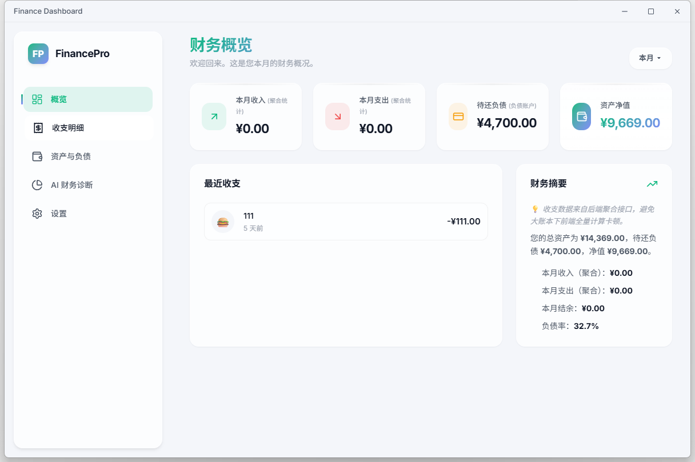

# Finance Dashboard


一个以 **本地优先** 为核心理念的桌面记账应用，基于 **Tauri v2 + React + Rust + SQLite** 构建。

- 适合个人资产负债管理、分期账单跟踪、日常流水分析。
- 支持 OpenAI 兼容接口的 AI 财务诊断。
- API Key 使用系统凭据管理器安全存储，避免明文落盘。

---

## 快速导航

- [项目亮点](#项目亮点)
- [功能清单](#功能清单)
- [项目预览](#项目预览)
- [技术栈](#技术栈)
- [架构与数据流](#架构与数据流)
- [快速开始](#快速开始)
- [配置说明](#配置说明)
- [数据存储与安全](#数据存储与安全)
- [CSV 导入导出说明](#csv-导入导出说明)
- [项目结构](#项目结构)
- [开发与贡献](#开发与贡献)
- [发布说明](#发布说明)
- [FAQ](#faq)
- [Roadmap](#roadmap)

---

## 项目亮点

- **本地数据闭环**：核心账本数据存储在本地 SQLite，离线可用。
- **高性能流水浏览**：后端分页 + 聚合接口，避免前端全量计算。
- **分期流程完整**：记一期还款会联动分期状态、账户余额与流水记录。
- **导入可追溯**：CSV 导入支持列映射与失败明细导出，便于修复重试。
- **安全配置升级**：AI API Key 存于系统 keyring，不再依赖 localStorage。
- **桌面体验一致**：统一动画语义层与 reduced-motion 降级策略，交互更稳。

---

## 功能清单

| 模块 | 能力 | 说明 |
|---|---|---|
| 财务概览 | 资产/负债/净值/周期收支 | 使用 `get_finance_snapshot` 后端聚合 |
| 收支明细 | 分页、筛选、CRUD | 支持账户/分类/类型/日期/金额/关键词筛选 |
| CSV 工具 | 导入+导出 | 导入支持失败明细导出，导出按当前筛选条件 |
| 资产与负债 | 账户管理 | 支持授信额度、账单日、还款日 |
| 分期管理 | 分期计划与还款 | 支持等额/自定义每期金额，自动记账联动 |
| AI 财务诊断 | 聊天分析 | OpenAI 兼容接口，流式回复 |
| 设置中心 | 主题与配置 | 品牌、主题、背景材质、AI 参数 |

---

## 项目预览

当前仓库默认未附真实截图。你可以把截图放到 `docs/images/` 目录，推荐文件名如下：

- `docs/images/dashboard.png`
- `docs/images/transactions.png`
- `docs/images/accounts.png`
- `docs/images/analytics.png`
- `docs/images/settings.png`

建议补充后在 README 中按下列方式展示：

```md

```

---

## 技术栈

### 前端

- React 19
- TypeScript 5
- Vite 5
- Zustand
- Tailwind CSS v4（配合自定义 Design Token）
- Tauri JS API（dialog/fs/shell）

### 后端（Tauri / Rust）

- Rust 2021
- Tauri 2
- rusqlite（bundled SQLite）
- chrono / uuid
- keyring

---

## 架构与数据流

### 前后端边界

- 前端通过 `@tauri-apps/api/core` 的 `invoke` 调用 Rust 命令。
- 命令入口位于 `src-tauri/src/commands.rs`。
- SQLite 初始化与 schema 位于 `src-tauri/src/db.rs`。

### 关键命令

- 账户：`get_accounts` / `create_account` / `update_account` / `delete_account`
- 流水：`get_transactions_page` / `create_transaction` / `update_transaction` / `delete_transaction`
- 聚合：`get_finance_snapshot`
- 分类：`get_categories` / `create_category` / `update_category` / `delete_category`
- 分期：`create_installment` / `get_periods` / `pay_period` / `cancel_installment`
- 安全配置：`load_api_key` / `save_api_key` / `clear_api_key`

---

## 快速开始

### 1) 环境要求

- Node.js 18+（推荐 LTS）
- npm 9+
- Rust 1.77+
- Tauri v2 前置依赖（按官方文档安装）

Windows 常见前置：

- Visual Studio C++ Build Tools
- WebView2 Runtime

### 2) 安装依赖

```bash
npm install
```

### 3) 启动桌面开发模式

```bash
npm run dev
```

该命令会先启动前端开发服务器，再由 Tauri 启动桌面应用壳。

### 4) 仅启动前端

```bash
npm run dev:fe
```

### 5) 构建

```bash
# 前端构建
npm run build:fe

# 桌面打包（Windows 默认 msi + nsis）
npm run build
```

### 6) 常用命令

| 命令 | 说明 |
|---|---|
| `npm run dev` | 启动 Tauri 桌面开发模式 |
| `npm run dev:fe` | 仅启动前端开发服务器 |
| `npm run build:fe` | 构建前端产物 |
| `npm run build` | 打包桌面应用 |
| `npm run preview` | 预览前端构建产物 |

---

## 配置说明

### AI 配置

在「设置」页配置：

- Base URL（如 `https://api.openai.com/v1` 或兼容服务）
- API Key
- Model（如 `gpt-4o`）

说明：

- API Key 存储在系统 keyring。
- Base URL / Model / 主题等非敏感项存储在 localStorage。

### 外观配置

- 应用名称与侧栏缩写
- 主题强调色
- 背景材质

保存后会实时应用。

---

## 数据存储与安全

### 数据库存储

- 数据库文件：`finance-data.sqlite`
- 存放位置：Tauri `app_data_dir()`
- 启动时自动创建表与索引，自动注入默认分类
- SQLite 启用 WAL 与外键约束

### 安全策略

- API Key 不再使用 localStorage 持久化。
- 关键敏感值使用 keyring 管理。

### 建议

- 不要把数据库文件和私钥提交到 Git。
- 需要跨设备同步时，建议自行增加加密备份流程。

---

## CSV 导入导出说明

### 导入能力

- 支持 CSV/TXT。
- 支持列映射：日期、类型、账户、金额、分类、描述。
- 兼容带引号字段、字段内逗号、字段内换行。
- 日期格式归一化，金额格式校验。

### 导入反馈

- 返回成功/失败统计。
- 失败行可导出明细（含行号、原因、原始列）。

### 导出能力

- 按当前筛选条件导出。
- UTF-8 BOM，兼容常见表格软件中文显示。

---

## 项目结构

```text
finance-dashboard/
├─ src/
│  ├─ api/                      # invoke 封装、类型定义
│  ├─ components/               # 组件（弹窗、侧栏、管理器）
│  ├─ hooks/                    # 业务 hooks
│  ├─ pages/                    # 页面
│  ├─ store/                    # Zustand
│  ├─ utils/                    # 工具函数（时间等）
│  └─ index.css                 # 设计变量与全局样式
├─ src-tauri/
│  ├─ src/
│  │  ├─ commands.rs            # Tauri 命令
│  │  ├─ db.rs                  # SQLite 初始化
│  │  └─ lib.rs                 # 应用入口和命令注册
│  └─ tauri.conf.json
├─ docs/
│  └─ images/                   # README 截图目录
├─ CONTRIBUTING.md
└─ README.md
```

---

## 开发与贡献

欢迎提交 Issue / PR。

- 贡献说明见：`CONTRIBUTING.md`
- 建议提交前执行：

```bash
npm run build:fe
cargo check --manifest-path src-tauri/Cargo.toml
```

---

## 发布说明

当前采用手动发布流程，建议约定语义化版本（SemVer）：

1. 更新版本号（`package.json` 与 `src-tauri/tauri.conf.json`）
2. 生成变更说明
3. 本地打包：`npm run build`
4. 打 Git Tag 并推送
5. 在 GitHub Release 上传安装包

---

## FAQ

### `npm run dev` 启动失败

- 检查 Node/npm 与 Rust 版本。
- 检查 Tauri 前置依赖是否安装完整。

### AI 页面提示未配置 API Key

- 到设置页保存 API Key。
- 如系统凭据被清理，需要重新填写。

### CSV 导入部分失败

- 查看导入结果统计。
- 导出失败明细，修正后重试。

### 想快速体验演示数据

- 在「资产与负债」页点击“注入测试数据”。

---

## Roadmap

- 报表维度扩展（分类趋势、账户趋势）
- 预算目标与阈值告警
- CSV 模板与自动映射增强
- 更多可访问性优化与国际化支持

---

## 版本信息

- 当前版本：`0.1.0`
- 应用标识：`com.finance.dashboard`

---

## License

当前仓库尚未声明开源许可证。如果计划公开分发，建议补充 `LICENSE` 文件（如 MIT / Apache-2.0）。
